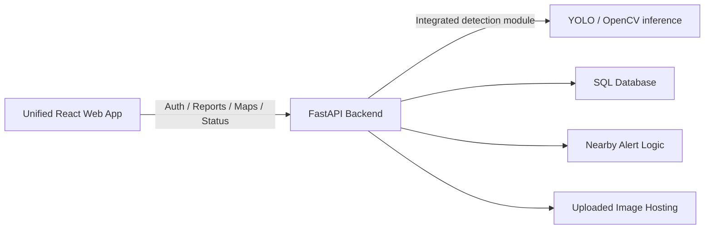

# Smart Pothole Detection and Road Safety System

An end-to-end smart city platform for pothole reporting, AI-based road damage detection, municipal response tracking, and driver safety alerts.

## Modules

- `backend/`: Single FastAPI app with integrated pothole detection, auth, report management, analytics, nearby alerts, upload hosting, and static website serving
- `dashboard/react-dashboard/`: Unified web app source for citizens and authorities, built and served by FastAPI
- `ai-model/`: Original YOLO training utilities and standalone experiments if you want to retrain later
- `mobile-app/flutter-app/`: Flutter mobile app scaffold if a native client is needed later
- `docs/`: architecture and deployment notes

## Core Features

- Citizen signup and login from the website
- Browser camera capture or file upload for pothole reports
- Automatic GPS tagging using browser geolocation
- Integrated pothole detection with bounding box, diameter estimate, severity classification, and optional depth hook
- Duplicate report merging within 10 meters
- Citizen status tracking for submitted reports
- Authority dashboard with filters, analytics, list view, map, and repair controls
- Driver warning preview for nearby potholes

## Architecture



## Prerequisites

Install Git LFS before cloning because this repository stores the local database and uploaded sample media with Git LFS.

```bash
git lfs install
git clone https://github.com/shouryachopra123-commits/Smart-Pothole-Detection.git
cd Smart-Pothole-Detection
git lfs pull
```

## Quick Start

### 1. Build the website

```bash
cd dashboard/react-dashboard
npm install
npm run build
```

### 2. Start the single app

```bash
cd backend
python -m venv .venv
.venv\Scripts\activate
pip install -r requirements.txt
python -m uvicorn app:app --reload --port 8000
```

Open `http://localhost:8000` to use the full system.

## Web User Flow

1. Sign up or log in from the web app
2. Click `Use My GPS`
3. Capture a pothole photo with the browser camera or upload one from disk
4. Submit the report
5. See the pothole appear on the map, in the authority queue, and in status tracking

## Default Port

- Single app and API: `8000`

## Key Endpoints

- `POST /api/auth/signup`
- `POST /api/auth/login`
- `POST /api/report`
- `GET /api/potholes`
- `GET /api/pothole/{id}`
- `PUT /api/status-update`
- `GET /api/nearby-potholes`
- `GET /api/analytics/summary`
- `GET /uploads/{filename}`

## Dataset Format

See [docs/dataset-format.md](./docs/dataset-format.md) for YOLO training structure and label format.

## Deployment

See [docs/deployment.md](./docs/deployment.md) for local and production deployment guidance.
