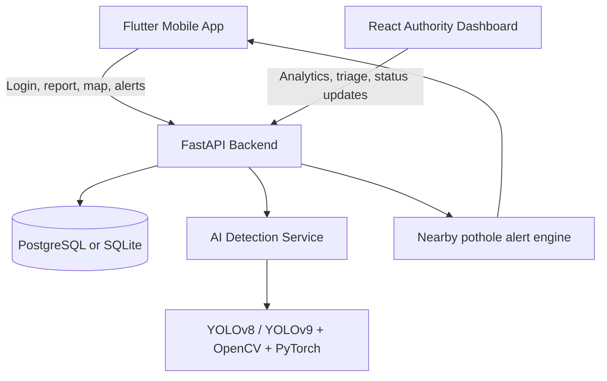

# Architecture Diagram

## Runtime Flow

1. A citizen captures a pothole photo in the mobile app.
2. GPS coordinates and optional description are submitted to the backend.
3. The backend sends the image to the AI detection service when a local file is available.
4. Detection returns pothole presence, bounding box, estimated diameter, severity, and optional depth estimate.
5. The backend merges duplicate reports within 10 meters or creates a new pothole record.
6. Authorities review reports on the dashboard and update repair status.
7. Drivers query nearby potholes and receive warning messages when approaching hazards.
